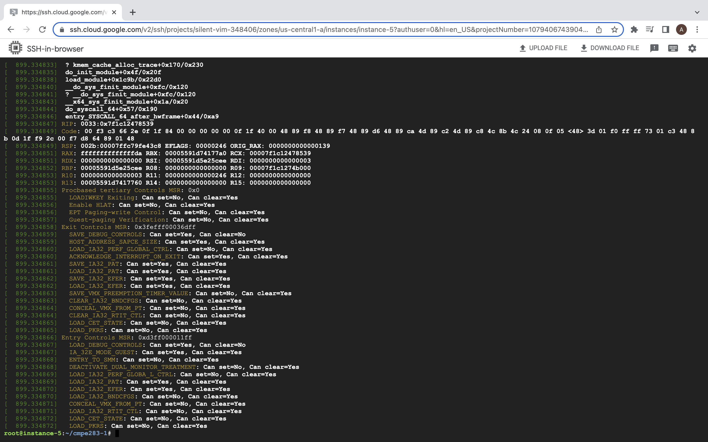
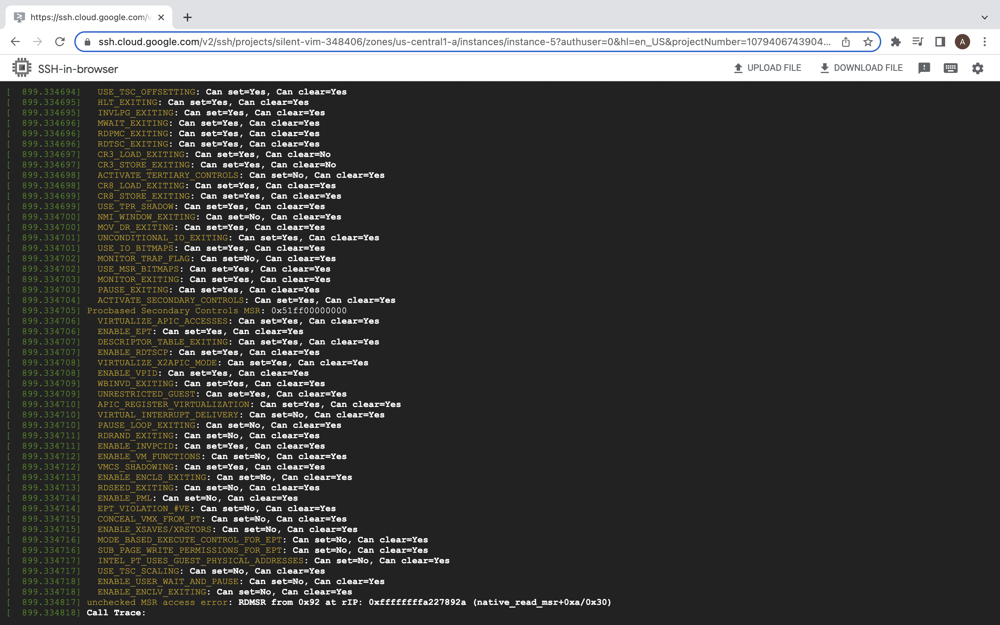
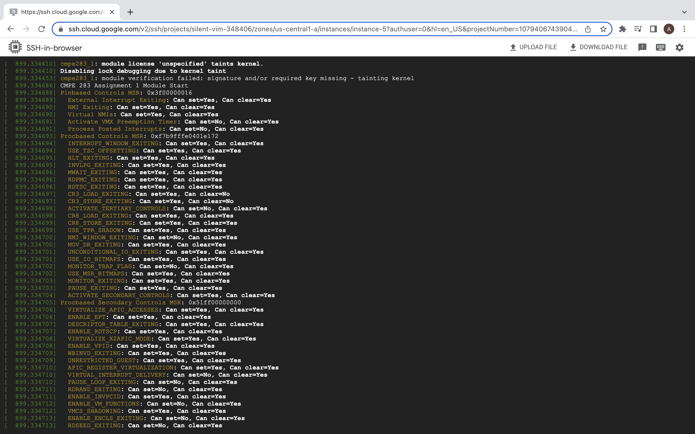

# CMPE_283

# Assignment 1

# Discovering VMX Features

## Anupama Ponukumati

1. Created vm using gcp UI with machine configuration as :
Machine type n2-standard-2
CPU platform Intel Cascade Lake Architecture x86/64

2. Executed following commands on console

#gcloud compute instances export instance-5 \
--destination=cmpe283.yaml \
--zone=us-central1-a

3. enabled virtualisation = true in cmpe283.yaml
advancedMachineFeatures: enableNestedVirtualization: true

4. #gcloud compute instances update-from-file instance-5 --source=cmpe283.yaml --most-disruptive-allowed-action=RESTART --zone=us-central1-a

5. Created directory :cmpe283-1

6. Created two files - 
Make file
cmpe283-1.c

for IA32_VMX_PINBASED_CTLS 0x481 IA32_VMX_PROCBASED_CTLS 0x482 IA32_VMX_EXIT_CTLS 0x483 IA32_VMX_ENTRY_CTLS 0x484
IA32_VMX_PROCBASED_CTLS2 0x48B IA32_VMX_PROCBASED_CTLS3 0x492

7. Executed following commands:
#make sudo bash apt install gcc make

    #exit

    #sudo apt install linux-headers-$(uname -r)

    #uname -r

    #make

    #sudo insmod ./cmpe283-1.ko

    #sudo dmesg

## Screenshots of Output

# Assignment 2

## Assignment 2: Instrumentation via hypercall

Your assignment is to modify the CPUID emulation code in KVM to report back additional information 
when special CPUID leaf nodes are requested.

* For CPUID leaf node %eax=0x4FFFFFFD:
◦Return the high 32 bits of the total time spent processing all exits in %ebx
◦Return the low 32 bits of the total time spent processing all exits in %ecx
▪%ebx and %ecx return values are measured in processor cycles, across all VCPUs

* For CPUID leaf node %eax=0x4FFFFFFF:
◦Return the time spent processing the exit number provided (on input) in %ecx
▪Return the high 32 bits of the total time spent for that exit in %ebx
▪Return the low 32 bits of the total time spent for that exit in %ecx

## Question 1

Anupama Ponukumati

## Question 2

Describe in detail the steps you used to complete the assignment.

Pre-requisite : 

Google Cloud Platform, create a VM as done in assignment 1

Instructions Step by step:

* Initial Setup .
* Build environment https://wiki.ubuntu.com/Kernel/BuildYourOwnKernel.
* Fork GitHub: git clone https://github.com/torvalds/linux.git. to your repo.
* Clone the Kernel code from personal repository into GCP VM 
* Kernel Code Compilation : 
uname -a 
cp /boot/config-5.8.0-43-generic ./.config make oldconfig make -j 2 modules && make -j 2 && sudo make modules_install && sudo make install reboot 
* Verify the updated Linux version: uname -a

* Install Make and GCC
* Executed the following commands - 

        * make oldconfig
        * make prepare
        * make -j 8 module
        * make -j 8
        * sudo make INSTALL_MOD_STRIP=1 modules_install
        * sudo make install
        * uname -a
        * sudo reboot
        * uname -a
        * make
        * lsmod | grep cmpe283
        * Demsg

* Make changes to cpuid.c and vmx.c. (Added the code)

* To avoid erros Install boot, BzImage and disable the below setting :
    scripts/config --disable SYSTEM_TRUSTED_KEYS
    scripts/config --disable SYSTEM_REVOCATION_KEYS
       
 * Build the code 
      * sudo make modules 
      * sudo make modules_install 
      * sudo make install 

* Use sudo apt-get install virt-manager to install virt-manager
* Create a nested virtual machine with virt-manager.
* Install gcc: https://linuxize.com/post/how-to-install-gcc-compiler-on-ubuntu-18-04/
* Compile test file: gcc test.c
* Check the output of gcc test.c

### Output

![Screenshot4] (Output2/image1.png)

![Screenshot5] (Output2/image2.png)

# Assignment 3

